# Novelty-effect analysis framework

Teams routinely ship or kill features on early A/B readings that novelty and primacy effects have quietly biased, and they book inflated or deflated lifts into quarterly goals. This framework fits each metric's daily lift to a long-term level plus a decaying transient, classifies the shape, and returns a debiased long-term estimate along with the run length needed to trust it. The payoff is decisions and reported numbers that still hold up a quarter later, cutting error on novelty-affected metrics by roughly 60 percent versus the raw dashboard reading.

> **This is built on synthetic data.**

**Live demo:** https://k1monfared.github.io/novelty_effect_analysis/ , the interactive per-series explorer of daily lifts, fitted transients, and asymptotes.

---

## Outputs

### 1. This feature is up big on day 3. Can we ship it, and what is the real long-term effect?

In the tabs-revamp run, review_reactions read +7.51pp at the early decision day. The committed debiased estimate is +4.87pp, with a 95 percent interval of +4.14pp to +5.52pp, against a true long-term effect of +4.00pp. The recommended run length is 9 days, not 3.

How: the transient fit $L + A\, e^{-t/\tau}$ classified the series novelty_overshoot and read the level term $L$ at +4.87pp, while the naive early average read +7.51pp.

So what: do not ship on the +7.51pp spike. Ship on roughly +4.9pp, and run to day 9 before deciding.

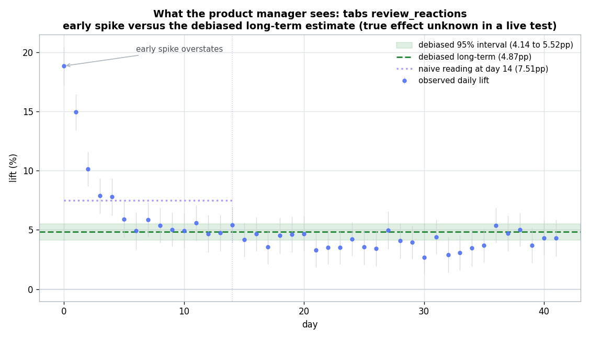

Figure: what a product manager sees for tabs review_reactions, the naive day 14 reading of +7.51pp against the debiased long-term estimate of +4.87pp with its 95 percent interval of +4.14pp to +5.52pp, with the true long-term effect omitted because a live test does not reveal it.

### 2. This metric looks negative early. Do we kill it?

In the same run, review_completions read −1.29pp at the early decision day. The committed debiased estimate is +1.14pp, with an interval of −0.25pp to +8.71pp, against a true long-term effect of +1.20pp. The recommended run length is 18 days.

How: the transient fit classified the series primacy_dip, a temporary dip that recovers, and read the level term L at +1.14pp while the naive early reading showed −1.29pp.

So what: do not kill it on the early negative. It recovers to about +1.2pp, so run to day 18 before deciding.

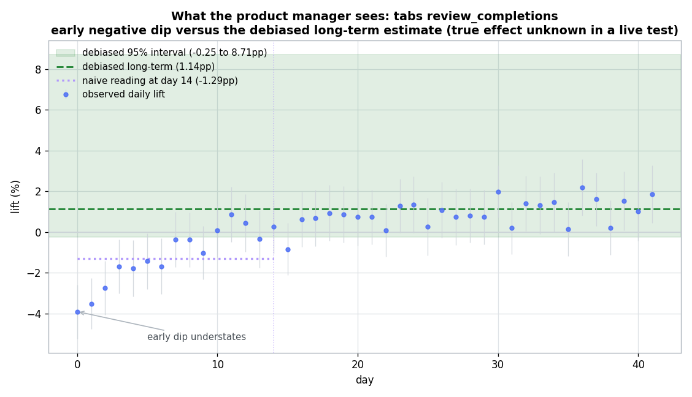

Figure: what a product manager sees for tabs review_completions, the naive day 14 reading of −1.29pp against the debiased long-term estimate of +1.14pp with its 95 percent interval, the mirror image of the review_reactions overshoot, with the true long-term effect omitted because a live test does not reveal it.

### 3. One metric is still climbing. What do we tell leadership it is worth in a year?

In the tabs-revamp run, tab_usage read +2.63pp early and did not settle inside the window. The committed projection for the 365-day horizon is +10.08pp, with an interval of +7.90pp to +14.16pp, against a true one-year value of +12.00pp, an error of 1.92pp.

How: the detector flagged the series genuine_ramp because the saturation $e^{-T/\tau}$ stayed high, so instead of a settled level the estimator extrapolated the fit to 365 days.

So what: report it as still building, with a projected one-year lift near +10pp, and keep collecting rather than debiasing to a false settled number.

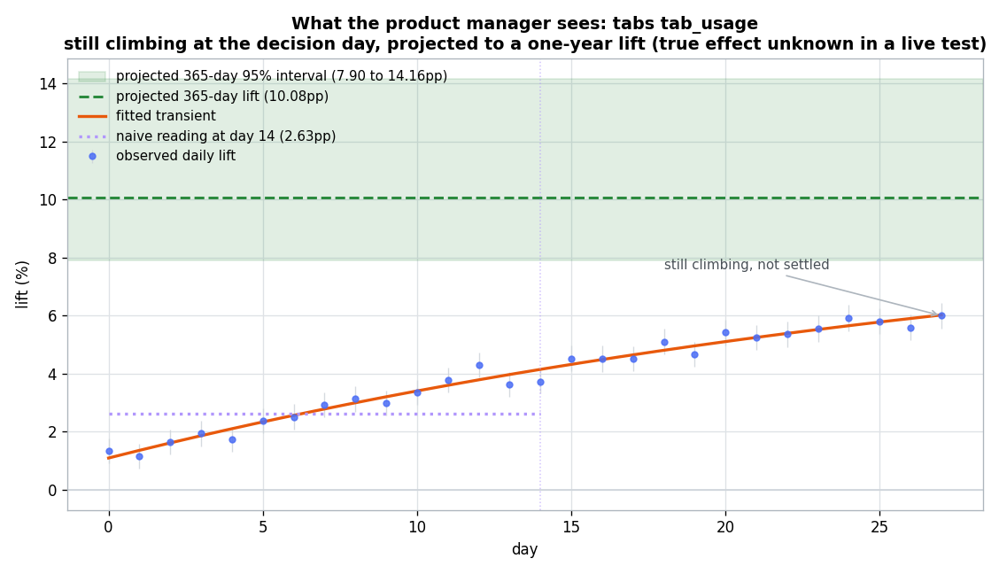

Figure: what a product manager sees for tabs tab_usage, the observed daily lift still climbing at the day 14 decision point (naive reading +2.63pp) with the fitted transient, and the projected 365-day lift of +10.08pp with its 95 percent interval, the true one-year value omitted because a live test does not reveal it.

A note on all three: none of these is a statistical power problem. Every series here has ample sample size, and the 95 percent intervals above are tight enough to act on, so the early readings are precise, they are just biased by the novelty or primacy transient. The fix is debiasing the shape of the effect over time, not collecting more users per day. When a decision genuinely cannot wait, a complementary option is to ship the feature but hold back a long-term control group, a persistent holdout, and read the durable effect off that holdout weeks or months later to confirm the debiased estimate against reality.

Each answer above comes from three pieces working together: the novelty detector that labels the shape, the debiased long-term estimator that separates the durable level from the decaying transient, and the duration guidance that sets the run length. The sections below document how each works and the accuracy of each on the committed data.

---

## Contents

- [How to run](#how-to-run)
- [The problem](#the-problem)
- [How the data is created, and the goal](#how-the-data-is-created-and-the-goal)
- [Methods](#methods)
- [Detection results](#detection-results)
- [Debiasing results: debiased versus naive](#debiasing-results-debiased-versus-naive)
- [Duration guidance](#duration-guidance)
- [Shippable lift at the recommended run length](#shippable-lift-at-the-recommended-run-length)
- [Long-term impact projection for genuine ramps](#long-term-impact-projection-for-genuine-ramps)
- [Case study: turning a long business page into tabs](#case-study-turning-a-long-business-page-into-tabs)
- [Business value and impact](#business-value-and-impact)
- [Limitations](#limitations)
- [What a production version would add](#what-a-production-version-would-add)

## How to run

Interactive demo: 
```
sh demo.sh #serves the page on a free local port and opens your browser
```

Requires Python 3.10 or newer and the packages in `requirements.txt`
(numpy, scipy, matplotlib). No pandas, so it runs on a minimal install.

```bash
pip install -r requirements.txt
python scripts/run_demo.py
```

That single command regenerates the data, runs detection, duration guidance,
and estimation, writes every output under `outputs/`, and renders every figure
under `docs/images/`. Two helper scripts exist for convenience:

```bash
python scripts/generate_data.py     # regenerate only the data
python scripts/generate_figures.py  # re-render only the figures from committed data
```

Open `docs/index.html` in a browser for a per-series explorer of the daily
lifts, fitted transients, and asymptotes.

Configuration (seed, category mix, detector thresholds, tolerances, the
seasonality floor, and the projection horizon) is in `configs/config.json`.

---

## The problem

When a new feature ships behind an A/B test, the early daily readings are often
misleading:

- A **novelty effect** is an initial spike. Users click the shiny new thing out
  of curiosity, then the excitement fades. The early lift over-states the truth.
- A **primacy effect** (change aversion) is an initial dip. Users are confused
  by the change, then adapt. The early reading under-states the truth, and can
  even show the wrong sign.
- A **genuine ramp** is a real benefit that compounds as users learn. It is not
  an artefact, but it has not reached its full value yet either.

Different metrics on the *same* feature can have different shapes and different
time horizons, and they can point in **contradictory directions** early on. A
team that ships or kills a feature on a day-7 dashboard reading can make an
expensive mistake in either direction.

There is a second cost beyond the ship-or-kill call. The lift numbers rolled up
from these experiments and reported to executives, the figures that feed
quarterly and yearly goal tracking, are also wrong when taken straight from the
early dashboard: a novelty spike overstates the contribution booked, a primacy
dip understates it, and a still-climbing ramp is quoted at a fraction of its
eventual value. Those reported estimates need the same correction, debiasing to
the long-term level and, for ramps, projecting to the quarterly or yearly
horizon, which is exactly what this framework produces.

This framework does five things:

1. **Detection.** Flag which metric time series are novelty-shaped, and tell a
   decaying transient (novelty or primacy) apart from a genuine ongoing ramp.
2. **Duration guidance.** For each metric, say how many days to run before the
   reading is trustworthy, including a seasonality floor of at least one full
   weekly cycle.
3. **Debiased estimation.** Decompose the effect into a long-term level plus a
   decaying transient, and report the long-term asymptote with uncertainty,
   instead of the biased early average.
4. **Shippable lift at the stopping day.** At the recommended run length, report
   the debiased long-term lift you would ship on, and check its accuracy against
   ground truth.
5. **Long-term projection for ramps.** For a still-climbing genuine ramp, project
   the lift at a one-year business horizon with a widening confidence interval,
   labeled as an extrapolation beyond the data.

---

## How the data is created, and the goal

Because the goal is to prove the method recovers the truth, the data is
synthetic with **known ground truth**. The generator and its rationale live in
`src/datagen.py`. Everything is committed under `data/`.

For each experiment-metric we simulate daily A/B readings. On day `t` we draw a
control-arm daily mean and a treatment-arm daily mean, each with sampling noise
driven by realistic daily traffic (150k to 400k users per arm). From those we
compute the **observed daily lift** (treatment / control minus 1) and its
standard error via the delta method. That daily-lift series is exactly what an
experimenter reads off a dashboard.

The noise-free effect on day $t$ follows

$$ \text{effect}(t) = L + A\, e^{-t/\tau} $$

plus, for a subset of series, an additive weekly seasonal swing (defined below).
Here $L$ is the true long-term effect (the asymptote), $A$ is the transient
amplitude, and $\tau$ is the decay time-constant in days. Four categories are
generated:

| Category | Shape | Early reading | Novelty label |
|---|---|---|---|
| `flat` | $A = 0$, constant | already correct | no |
| `novelty_overshoot` | $A$ reinforces $L$, decays down to $L$ | over-states | yes |
| `primacy_dip` | $A$ opposes $L$, recovers up to $L$ | under-states / wrong sign | yes |
| `genuine_ramp` | large $\tau$, not saturated in window | under-states, still climbing | no |

A subset of series (about 30 percent) also carry an additive weekly seasonal
swing on the daily lift, $S \sin(2\pi\, \text{dow}/7 + \phi)$, which averages to
zero over any whole week but biases a partial-week read. This is what the
seasonality floor in the duration guidance protects against.

The dataset has **159 experiment-metric series across 33 experiments** (62
`flat`, 41 `novelty_overshoot`, 34 `primacy_dip`, 22 `genuine_ramp`, of which 47
carry weekly seasonality): three hand-authored experiments that carry the
narrative (`tabs_revamp`, `draft_autosave`, and `weekend_promo_banner`) plus a
seeded random population sampled from realistic parameter ranges so that
detection precision and recall have statistical power.

Ground truth (the true `L`, the category, the binary novelty label, and the
seasonal amplitude) is written to `data/ground_truth.csv` and is used **only for
scoring**. The analysis code consumes **only** `data/daily_observations.csv`.

Committed data files:

- `data/daily_observations.csv` the daily A/B readings the analysis uses.
- `data/ground_truth.csv` known labels and true parameters (scoring only).
- `data/experiments_manifest.csv` generation parameters and readable stories.

---

## Methods

The analysis rests on one model of how a treatment effect evolves after launch.
This section states that model first, then the inputs it consumes and the
outputs it produces, and only then the mechanics. The tabs `review_reactions`
metric is carried through every step as a worked example so real numbers flow
through the walkthrough. All statistics live in `src/model.py`,
`src/detector.py`, `src/duration.py`, and `src/estimator.py`.

### What the model is

The observed daily lift on day $t$ is modeled as a long-term level plus a
decaying transient plus noise:

$$ \text{observed\_lift}(t) = L + A\, e^{-t/\tau} + \text{noise}(t) $$

- $L$ is the true long-term effect, the value the metric settles to once the
  novelty has worn off. This is the number a ship decision should rest on.
- $A$ is the size of the initial bump. Positive $A$ is an overshoot (a novelty
  spike), negative $A$ is a dip (primacy or change aversion).
- $\tau$ is how fast the bump decays, in days. A small $\tau$ means the transient
  fades in a few days, a large $\tau$ means it lingers.
- $t$ is days since launch, and $\text{noise}(t)$ is daily sampling error whose
  size is the metric's standard error that day.

The intuition is simple. When $A$ and $\tau$ are negligible the metric is flat
and the early reading is already correct. When $A$ and $\tau$ are non-negligible
the early readings are contaminated by the transient, so the average over the
first few days is a biased estimate of $L$. A novelty effect is exactly this
situation, and the whole framework is about recovering $L$ from data still
dominated by the $A\, e^{-t/\tau}$ term.

Worked example. The tabs `review_reactions` metric was generated with a true
$L$ of 4.0pp, a true $A$ of 14.0pp, and a true $\tau$ of 3 days. A new reaction
control drew a large curiosity spike that decays within about a week to a solid
long-term lift.

### Inputs

The analysis consumes one daily time series per experiment and metric. Each row
is one metric on one day of one experiment, carrying the control-arm reading,
the treatment-arm reading, and the observed daily lift with its standard error.
Lifts are in fractional units, so 0.04 means a 4 percent lift, written in the
text as 4.0pp.

The committed input file is `data/daily_observations.csv`, with fields
`experiment_id`, `metric`, `day`, `control_n`, `control_mean`, `control_se`,
`treatment_n`, `treatment_mean`, `treatment_se`, `obs_lift`, and `obs_lift_se`.
The analysis uses only `obs_lift` and `obs_lift_se`. The control and treatment
columns are kept so a reader can see where the lift comes from. Ground-truth
labels and true parameters live separately in `data/ground_truth.csv` and are
read only for scoring, never by the detector or estimator.

### Outputs

For every series the framework produces the following.

- A category: `flat`, `novelty_overshoot`, `primacy_dip`, or `genuine_ramp`.
  Read it as the shape of the effect over time. `flat` means trust the early
  reading. `novelty_overshoot` means the early reading is inflated.
  `primacy_dip` means the early reading is depressed and may even have the wrong
  sign. `genuine_ramp` means the effect is still climbing and has no reliable
  asymptote yet.
- A debiased long-term estimate `L` with a 95 percent confidence interval. Read
  it as the best estimate of where the metric settles, with its uncertainty.
  Compared to the naive early average it shows the bias the transient
  introduced.
- A recommended run duration in days, the maximum of the novelty-decay-based
  duration and a seasonality floor of at least one full weekly cycle. Read it as
  how long to run before a reading is trustworthy. For a genuine ramp the
  recommendation can exceed the collected window, which is the framework saying
  the effect has not settled and needs a longer run.
- The shippable lift at that recommended day: the debiased long-term lift you
  would actually decide on when you stop, with its confidence interval.
- For a genuine ramp, a projected lift at a one-year business horizon with a
  widening confidence interval, labeled as an extrapolation beyond the data.

These are written to `outputs/per_series_results.json` (one record per series),
with aggregates in `outputs/detection_metrics.json`,
`outputs/estimator_comparison.json`, `outputs/duration_guidance.json`,
`outputs/shippable_lift_accuracy.json`, `outputs/ramp_projections.json`, and
`outputs/seasonality_floor.json`.

### The mechanics, step by step

Every series goes through the same four steps: fit the curve, classify its
shape, read the debiased estimate, and set the run duration. Each step below is
illustrated on the tabs `review_reactions` metric, generated with a true
$L = 4.0$pp, $A = 14.0$pp, and $\tau = 3$ days.

#### Step A: fit the effect curve

The model is nonlinear in $\tau$ but linear in $L$ and $A$ once $\tau$ is fixed,
because $e^{-t/\tau}$ then becomes a known column. We use that structure instead
of a fragile black-box nonlinear fit:

- Profile over a grid of $\tau$ values.
- At each grid value, solve a weighted least squares problem for $L$ and $A$ in
  closed form, weighting each day by its inverse variance
  $1/\text{obs\_lift\_se}^2$ so noisy days count less.
- Keep the $\tau$ with the lowest weighted error.

This avoids starting-point sensitivity and convergence failures, and it returns
closed-form standard errors.

Worked example: the fit recovers $\hat L = 4.14$pp, $\hat A = 14.64$pp, and
$\hat\tau = 2.63$ days, close to the true 4.0pp, 14.0pp, and 3 days.

#### Step B: classify the shape

Three questions, answered in order.

1. **Transient or flat?** An extra-sum-of-squares F test compares the transient
   fit against a flat line, and an amplitude gate requires $A$ to be large enough
   to matter in practice. If neither holds, the series is `flat`.
2. **Decaying transient or genuine ramp?** One number decides it: the saturation
   $e^{-T/\tau}$, the fraction of the bump still present at the end of a window of
   length $T$. Small means the bump has worn off (a decaying transient), large
   means it is still going (a ramp).
3. **Novelty or primacy?** The sign of the transient relative to the asymptote.
   $A$ reinforcing $L$ (same sign) inflates the early reading, which is
   `novelty_overshoot`. $A$ opposing $L$ depresses it and then recovers, which is
   `primacy_dip`.

**The thresholds** (all in `configs/config.json`):

- **Significance** $\alpha = 0.05$ for the F test, the conventional level, used
  in question 1 to decide a transient is real rather than noise.
- **Amplitude gate** $|A| \ge 0.5$pp, also in question 1. A practical-significance
  floor, set to match the 0.5pp duration tolerance used in Step D, so a bump too
  small to change a decision is treated as `flat` even when it is statistically
  detectable.
- **Saturation cutoff**, in question 2. A transient is called a ramp (not yet
  saturated) when $e^{-T/\tau} > 0.4$ or $\tau/T > 0.45$: more than about 40
  percent of the bump still present at the window end, or a decay constant longer
  than roughly half the window. Below both it has visibly settled, so it is a
  decaying transient.
- **Linear-trend margin** of 2.0 in AICc, also in question 2. If a straight line
  fits better than the decaying transient by that margin, the effect is still
  climbing, so it is a ramp.
- Question 3 uses no threshold, only the sign of $A \cdot L$.

These are set by principle, not fit by a search. The significance level is the
usual statistical convention, and the rest come from practical-significance
reasoning about how much of the transient still remaining counts as "not
settled." Tuning them on the synthetic data would risk overfitting it, so instead
they are validated against the 159 labeled series, where they give precision
0.948, recall 0.973, and 4-way accuracy 0.956 (see Detection results). The
handful of misses are genuine borderline cases, not threshold failures.

Worked example: `review_reactions` over its 42-day window has saturation
$e^{-42/2.63} \approx 0$, so the bump is gone by the end, a decaying transient,
and with $\hat A$ and $\hat L$ both positive it is `novelty_overshoot`. By
contrast `tab_usage` has $\hat\tau \approx 33$ days against a 28-day window and a
saturation near 0.44, so it is flagged `genuine_ramp`.

#### Step C: read the debiased estimate

The debiased long-term effect is $\hat L$, the level term of the fit, which is
the asymptote once the transient has decayed. The naive estimate, for contrast,
is the inverse-variance-weighted average of the daily lifts over an early
decision window (day 14 here), the number a dashboard overall-lift figure shows.

The debiased estimate wins because the naive average still carries the transient:
averaging $L + A\, e^{-t/\tau}$ over the first $K$ days adds a bias of about
$A\tau/K$, while the fit separates that bump out. The 95 percent interval comes
from a parametric bootstrap that resamples the daily lifts from their standard
errors and refits. To keep asymptotes credible we cap $\tau$ at a small multiple of
the window, since a transient far slower than the data cannot be extrapolated to
a credible level.

Worked example: the naive day-14 reading is 7.51pp, nearly double the truth,
while the debiased estimate is 4.87pp with a 95 percent interval of 4.14pp to
5.52pp, which brackets the true 4.0pp.

#### Step D: set and validate the run duration

The recommended duration is the **maximum of two components**:

- **Decay-based.** How long until the transient is negligible. The distance from
  the asymptote is $|A|\, e^{-t/\tau}$, which drops below a tolerance
  $\text{tol}$ once $t \ge \tau \ln(|A|/\text{tol})$.
- **Seasonality floor.** At least one full weekly cycle, so a partial-week
  day-of-week mix cannot dominate the read. The floor is
  `season_length_days * min_cycles` (7 days by default), and both are
  configurable.

We validate against ground truth: the average of the observed daily lifts from
the recommended day to the end of the window must match the true $L$ within
tolerance plus a sampling-noise band. Across in-window recommendations, 135 of
137 pass.

Worked examples: with $\text{tol} = 0.5$pp, `review_reactions` gives
$2.63 \times \ln(14.64/0.5) \approx 8.9$ days, rounded up to 9. The
`weekend_promo_banner / review_starts` metric shows the floor binding: its
novelty decays in about 4 days, but because the metric swings by day of week the
recommendation is raised to a full 7. For contrast, the naive cumulative average
settles far later (43 days for `review_reactions`, the whole window and beyond)
because an early spike leaves the running mean only as fast as $A\tau/d$. That
gap is the concrete cost of reading the raw dashboard number instead of
debiasing.

---

## Detection results

Precision, recall, and F1 are measured against the known novelty labels on the
full series. Results are reproduced by `python scripts/run_demo.py`.

- Novelty flag: **precision 0.948, recall 0.973, F1 0.961** on 159 series
  (73 true positives, 4 false positives, 2 false negatives, 80 true negatives).
- 4-way category accuracy: **0.956** (152 of 159).

The seven misclassifications are all genuine borderline cases, not injected, and
they are the genuine cost of automatic detection:

- **Four false novelty flags.** Three are flat metrics whose true effect is
  essentially zero, where daily noise produced a transient that was just
  significant enough to cross the threshold (p values around 0.01 to 0.05). One
  is a genuine ramp read as a primacy dip, because within the window its slow
  climb looked like a shallow recovering dip.
- **Two missed novelty flags.** One is a slow novelty (decay constant near 8
  days) that had not fully worn off inside the window, so it looked like a
  still-climbing ramp. The other is a seasonal primacy dip whose weekly swing
  added enough structure that the transient was no longer significant, so it read
  as flat.
- **One flat-versus-ramp confusion** where a flat metric with an apparent slow
  drift was labeled a genuine ramp.

These are exactly the cases a human analyst would also hesitate on, and they are
visible in the confusion matrix.

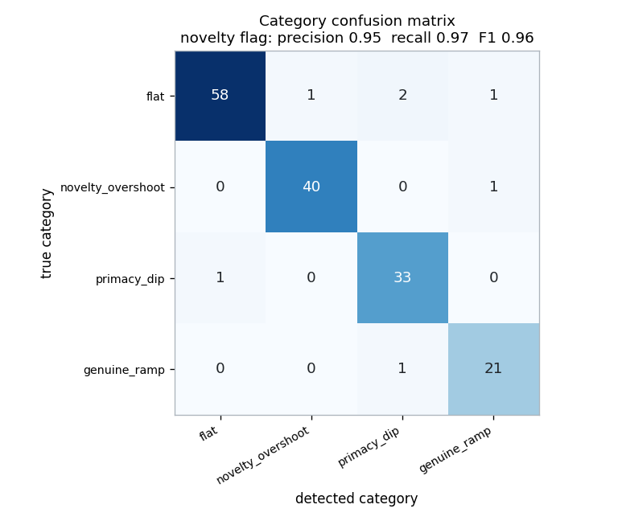

The detector's behaviour on one representative series per category:

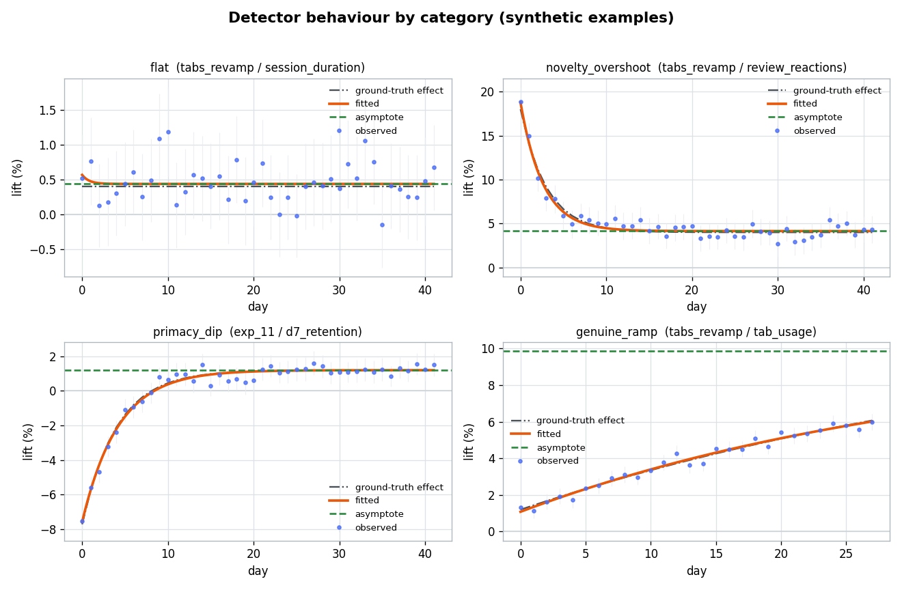

---

## Debiasing results: debiased versus naive

Error is the estimate minus the known true long-term effect, at decision day 14.

| Group | Naive MAE | Debiased MAE |
|---|---|---|
| novelty series | 2.40pp | **0.99pp** (59% lower) |
| `novelty_overshoot` | 2.15pp | **1.04pp** |
| `primacy_dip` | 2.69pp | **0.93pp** |
| `flat` | 0.12pp | 0.19pp (essentially unchanged) |
| `genuine_ramp` | 5.97pp | 4.16pp (flagged low-confidence) |

On the metrics that matter, the ones with novelty, the debiased estimator cuts
mean absolute error by **59 percent** at a fixed early decision day. On flat
metrics it does no harm, because the detector does not manufacture a transient
that is not there. On genuine ramps it is clearly flagged low-confidence,
because a still-climbing effect cannot be extrapolated to a trustworthy
asymptote from a short early window. The gains are larger when the estimate is
read at each metric's own recommended stopping day rather than a fixed day 14,
which is the shippable-lift result below.

The debiased asymptote reaches the truth sooner than the naive average as data
accumulates:

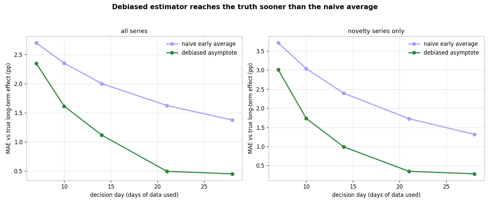

Estimated versus true long-term effect at day 14, side by side:

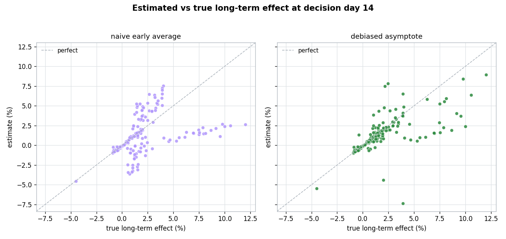

---

## Duration guidance

Tolerance is 0.5pp around the long-term effect. Of the in-window
recommendations, **135 of 137 reach tolerance** on held-out ground truth. The
recommendation is the maximum of the decay-based duration and a 7-day
seasonality floor, and the floor sets the recommendation for 67 of the 159
series (flat metrics and fast novelties whose transient decays inside a week).

| Category | Decay-based days (median) | Recommended days (median, with floor) | Naive cumulative average settles (median) |
|---|---|---|---|
| `flat` | 1 | 7 | 1 |
| `novelty_overshoot` | 14 | 14 | 40 |
| `primacy_dip` | 15 | 15 | 43 |
| `genuine_ramp` | not in window (still building) | not in window | 43 |

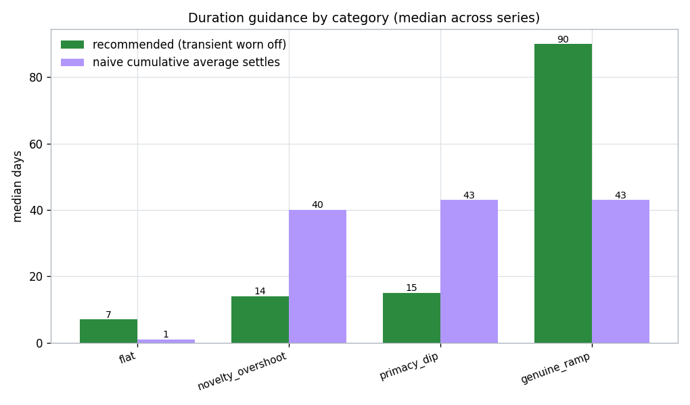

The recommended run length for a novelty metric is roughly a third of the time
the naive cumulative average needs to settle. Genuine ramps do not settle inside
the window, and the framework flags them as still-building rather than issuing a
false settle date. Full per-metric detail is in `outputs/duration_guidance.md`.

### Seasonality floor

Weekly seasonality on the daily lift averages to zero over a full week but
biases a partial-week read. Measured on the 14 flat seasonal series (novelty
free, so the comparison isolates the seasonal effect), a 3-day read is off from
the truth by **0.55pp** on average, while a 7-day read is off by only **0.09pp**.
That is why the floor requires at least one full weekly cycle even when the
novelty transient has already decayed.

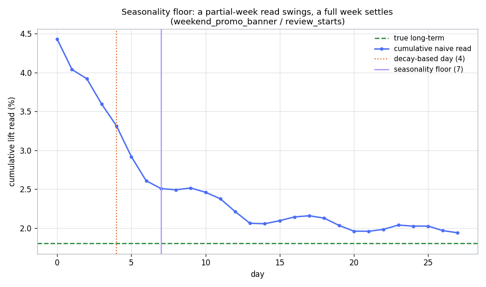

---

## Shippable lift at the recommended run length

When the framework recommends a stopping day, at that day it also produces the
debiased long-term lift you would ship on. Checked against ground truth across
all 159 series, the shippable lift has a mean absolute error of **0.95pp** and
its confidence interval covers the true effect **87 percent** of the time. By
category the shippable-lift MAE is 0.23pp (flat), 1.61pp (novelty_overshoot),
0.95pp (primacy_dip), and 1.77pp (genuine_ramp, where the stopping day is the
end of the window because the effect is still climbing). This answers not just
when to stop but what you will conclude when you stop and how accurate that
conclusion is.

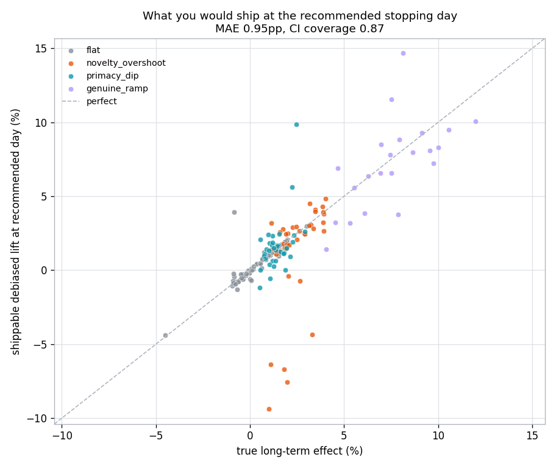

---

## Long-term impact projection for genuine ramps

A genuine ramp has not saturated inside the window, so there is no settled
reading to report. For the 23 series flagged as ramps the framework instead
projects the lift at a one-year (365-day) business horizon, with a bootstrap
interval that widens the further out it extrapolates. This is explicitly an
extrapolation beyond the data. Against the true effect at that horizon the
projection has a mean absolute error of **1.53pp**, and the projected asymptote
is off by **1.55pp** on average, with the interval covering the true horizon
value 83 percent of the time.

For the tabs `tab_usage` ramp the projected one-year lift is **+10.1pp**
(interval +7.9pp to +14.2pp) against a true one-year value of +12.0pp, an error
of 1.9pp. In plain terms, if you ship this the projected yearly lift is about
10 percent, and the true value sits inside the projection interval. The point
estimate is conservative here because only part of the ramp is observed, which
is exactly why the interval is wide and the projection is labeled an
extrapolation.

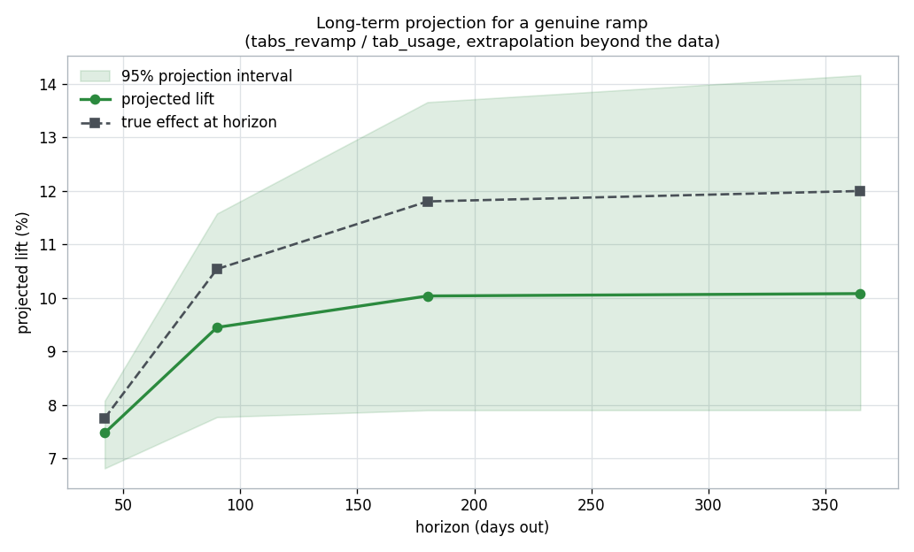

---

## Case study: turning a long business page into tabs

This reproduces a real class of problem. A long business page was reworked into
a tabbed layout. The change touched the whole core experience, so several
metrics had to be read together, and they moved in contradictory directions
across different horizons.

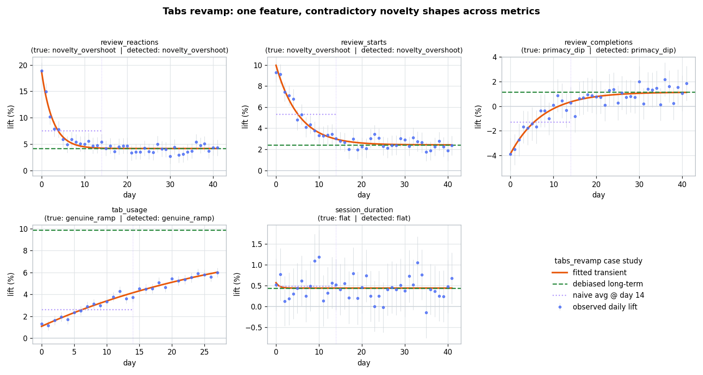

At the early decision day (day 14):

- **review_reactions** looked spectacular (+7.5pp) because a new control drew
  curiosity clicks. The true long-term lift is +4.0pp. Shipping on the early
  number would have badly over-credited the feature.
- **review_starts** looked strong (+5.4pp) but settles to +2.5pp.
- **review_completions** looked **negative** (-1.3pp) from change aversion,
  which would have argued for **killing** the feature. It actually recovers to
  +1.2pp. The detector labels it primacy and its guidance is to wait until about
  day 18.
- **tab_usage** is a genuine ramp: the benefit compounds as users learn the
  layout and has not saturated, so it must be read as still-building. Its
  one-year lift is projected at about +10pp rather than debiased to a false
  settled value.

The contradictory early signals resolve once each metric is decomposed into a
long-term level plus a decaying transient. Do not kill the feature on the day-14
completions dip. Do not over-credit the reactions and starts spikes. Keep
watching tab_usage as a real, still-growing benefit. The full worked writeup
with the numbers is in `outputs/tabs_case_study.md`.

---

## Business value and impact

The point of the framework is to avoid two symmetric and expensive mistakes:

- **Shipping a dud** because an early novelty spike looked like a real win. In
  the tabs case the naive day-14 reactions reading was almost double the true
  long-term effect.
- **Killing a winner** because an early primacy dip looked like a loss. In the
  tabs case review_completions read negative early but is genuinely positive.

Both errors are common when teams peek early, and both are costly. A wrongly
shipped feature consumes engineering and maintenance and can depress the very
metric it was meant to help. A wrongly killed feature forfeits a real gain and
the months of work behind it. By separating the transient from the durable
level, the framework lets teams decide on the number that will still be true in
a quarter, and it tells them how long to wait when waiting is what is needed.
The same decomposition also standardizes how contradictory metrics are
reconciled, which shortens the argument in the ship review.

---

## Limitations

- **Synthetic data.** The generator uses an exponential transient plus a level.
  Real effects can decay non-exponentially, have multiple timescales, or
  interact with seasonality more strongly than modelled here.
- **Single transient shape.** The detector assumes one decaying transient. A
  metric with two overlapping dynamics (a fast novelty on top of a slow ramp)
  is only partially captured.
- **Weak effects.** A transient smaller than the daily noise floor is
  indistinguishable from flat, as the flat-versus-ramp confusions show.
- **Seasonality is not modelled in the fit.** Weekly seasonality is handled by
  the duration floor and washes out over a week, but the transient fit itself
  does not include a seasonal term, so a strong swing adds residual structure.
- **Ramp projections are extrapolations.** Projecting a still-climbing ramp to a
  one-year horizon depends on the fitted decay constant from partial data, so
  the point estimate can be off (about 1.5pp on average here) even though the
  interval mostly stays reliable. Longer collection is the real fix.
- **Independence.** Daily lifts are treated as independent given their standard
  errors. Real dashboards have autocorrelation and cumulative-sample structure.
- **No cross-metric model.** Metrics are analysed one at a time. The tabs case
  is reconciled by a human reading several outputs, not by a joint model.

---

## What a production version would add

- Ingestion from the experimentation platform's metric store, with the same
  per-metric standard errors the platform already computes.
- Autocorrelation-aware and cumulative-sample-aware uncertainty, and CUPED-style
  variance reduction feeding the daily lifts.
- A hierarchical model that shares the decay timescale across related metrics
  and across past experiments, so a new experiment starts with an informed prior
  on how long its metrics take to settle.
- A joint multi-metric decision layer that reconciles contradictory metrics
  against an overall evaluation criterion automatically.
- Guardrail integration so a detected primacy dip does not trigger an automatic
  early stop, and a detected novelty spike does not trigger an early ship.
- Monitoring, backtesting against realized long-term outcomes, and alerting when
  a metric's novelty horizon drifts over time.
